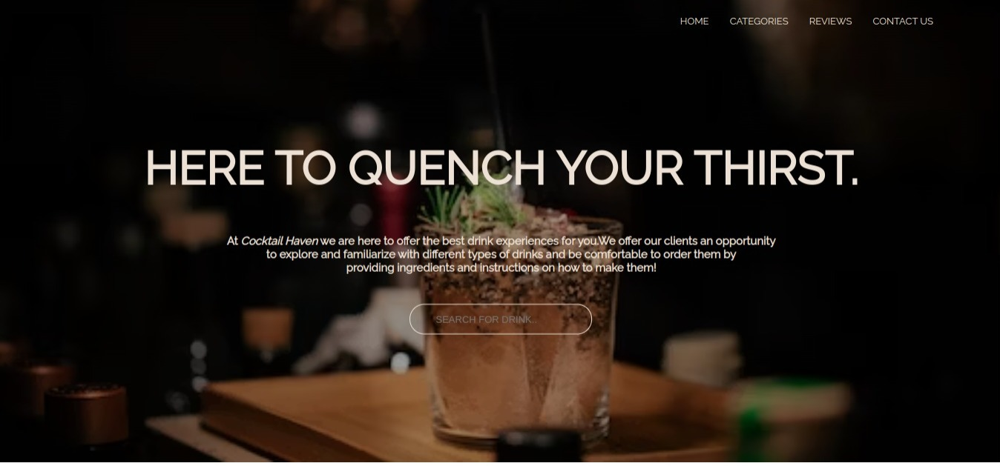
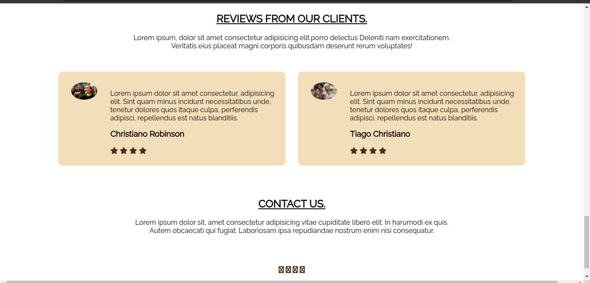

# COCKTAIL HAVEN   

Using `Cocktail Haven`,  users can be able to search for a particular drink of their choice and get the instructions on how to make a similar drink. The web app also allows users to know the ingredients used to make the drink and their measurements. 

## PROJECT GOALS.    
---

- Design and architect features across ui.
- Communicate and collaborate in a technical environment.
- Integrate JavaScript and an external API.
- Debug issues in small- to medium-sized projects.
- Build and iterate on a project MVP.

## PROJECT REQUIREMENTS.   
---

- Your app must be a HTML/CSS/JS frontend that accesses data from a public API. All interactions between the client and the API should be handled asynchronously and use JSON as the communication format. (Alternatively use an Array)

- Your entire app must run on a single page. There should be NO redirects. In other words, your project will contain a single HTML file.

- Your app needs to incorporate at least 3 separate event listeners (DOMContentLoaded, click, change, submit, etc).

- Some interactivity is required. This could be as simple as adding a "like" button or adding comments. These interactions do not need to persist after reloading the page.

- Follow good coding practices. Keep your code DRY (Do not repeat yourself) by utilizing functions to abstract repetitive code.

## TECHNOLOGIES USED.  
---

The following have been used on this project:

- HTML
- CSS
- JavaScript

  - #### Live link to view the project  <a href="https://gathoni-wanjira.github.io/Cocktail-Haven/">Cocktail Haven .</a>

## SETUP REQUIREMENTS.  
 ---

- Git
- Web-browser or your choice
- Github

## SCREENSHOTS OF THE APPLICATION.

- HOME SECTION.

    

- CATEGORIES SECTION.

   

- REVIEWS SECTION. 
 

   

- SAMPLE CATEGORIES CLICK RESULTS. (COCKTAILS)

   

## AUTHOR  
---

- [Gathoni Wanjira](https://github.com/Gathoni-Wanjira)

## COPYRIGHT.  
--- 

Released under the MIT License. See the [LICENSE](https://github.com/Gathoni-Wanjira/Cocktail-Haven/blob/main/LICENSE) file.